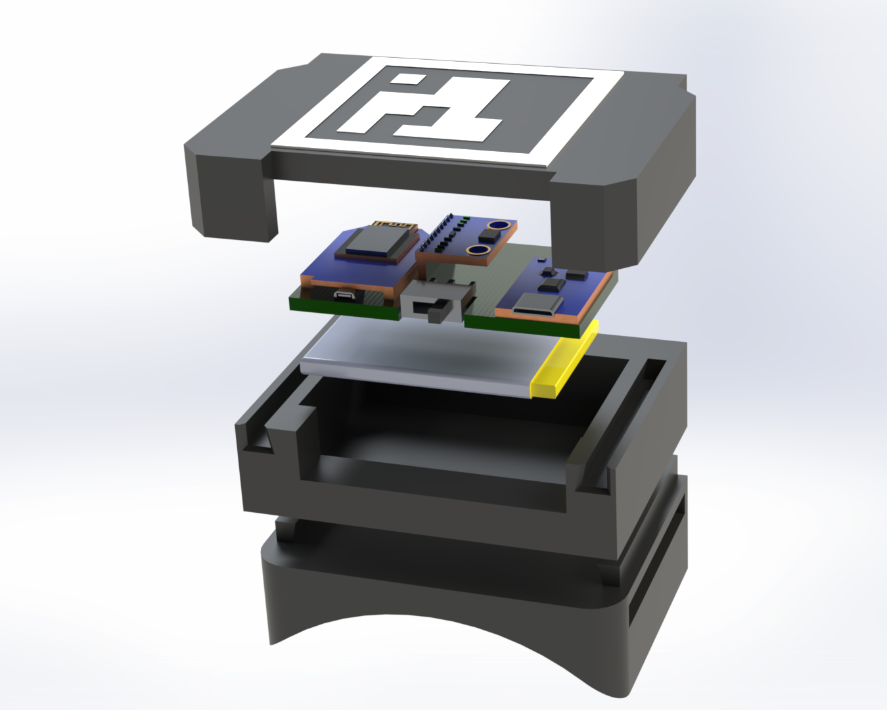

# RoSHI Hardware

Hardware resources for the paper **RoSHI: A Versatile Robot-oriented Suit for Human Data In-the-Wild** (IROS 2026).

<p align="center">
  <a href="https://roshi-mocap.github.io/"></a>
  &nbsp;
  <a href="https://roshi-mocap.github.io/documentation/hardware/index.html"></a>
</p>



This repository contains the **3D-printed parts**, firmware, and helper scripts for building the nine wireless IMU trackers used in RoSHI.

## Repository layout

| Path | Contents |
|------|----------|
| `3D Prints/` | STEP and STL models (receiver, IMU case, holder, and related parts) |
| `Firmware/IMU_Tracker/` | Tracker firmware (ESP8266 + BNO08x, ESP-NOW) |
| `Firmware/IMU_Receiver/HostRead/` | Host/receiver firmware (ESP32 + OLED) |
| `Firmware/python/` | `imu_reader.py`, `sample.py`, `visualize.py` — serial reader and examples |
| `Images/` | Figures such as the hardware render above |

## Python scripts

The scripts in `Firmware/python/` use only a few lightweight packages. Install them with:

```bash
pip install pyserial numpy matplotlib
```

From `Firmware/python/`, run e.g. `python sample.py` or `python visualize.py` with the ESP32 host connected over USB.
